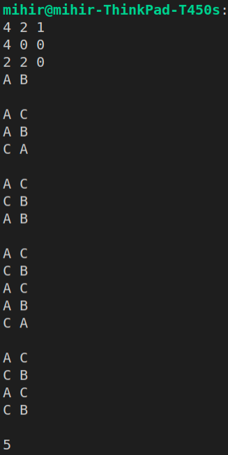

# state_space_search

## Compilation:
```bash
    gcc -c header.h client.c
    gcc -c header.h impl.c
    gcc client.o impl.o
    ./a.out
```
    OR (iff impl.c, client.c, header.h files are there in one folder)
```bash
    gcc *.c
    ./a.out
```
## Test case 


## Data Structures Used:
    • For the state transition list a doubly linked list is implemented.
    • A call back array, an array of pointers to functions, is used to hold the 6 possible
    transition functions in the order that is required (indices 0,1,2,3,4,5).

## Implementation Logic:
    • A transition list and 3 states start, goal, capacity states are created
    • The start state is added at the end of the list
    • To obtain all the possible solutions, run the logic until the head of list is NULL
    • A transition is applied on the state at the tail to obtain a new state
    • This state is checked for its validity and if or not this new state is repeated.
    • If it is valid and not repeated, the new state is added to the transition list
    • The new state is then checked if it is the goal state, if so then display the list as a solution
    • If the new state obtained is NOT valid or if it is REPEATED then it is ignored
    • Then choice_of_move field is incremented for the state at the tail of the list.
    • The state is removed from the list if all possible transitions are tried (i.e. choice_of_move > 5)
    • The removal happens until the list is empty or if we obtain a state where
    all other transitions are NOT tried (i.e. choice_of_move <= 5)

## Key takeaways from this assignment:
    • The iterative approach of the algorithm is elegant and easier to understand
    • The state space search technique is immensely used in artificial intelligence
    • Very efficient way to obtain a desired state given a start state where there are many possible
    paths